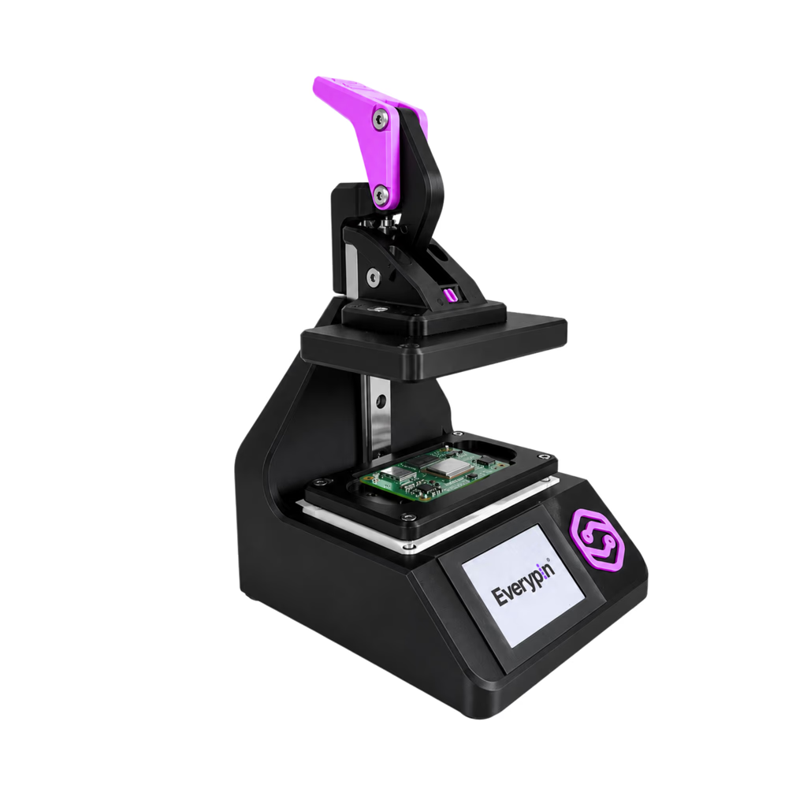

# CM5 Flash Jig

A production fixture for flashing Raspberry Pi Compute Module 5 modules through test points.

> **Want a ready-to-use jig?** [Order an assembled CM5 Flash Jig from Everypin.](https://everypin.io/solutions/cm5-flash-jig)
