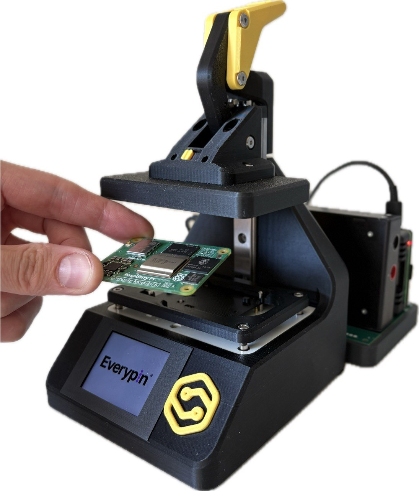

# CM4/CM5 Flash Jig

The CM4/CM5 Flash Jig is a production fixture for flashing Raspberry Pi Compute Module 5 modules through board test points. It is designed for teams that need to program multiple modules reliably without repeatedly using the 100-pin mezzanine connectors, carrier boards, or fragile manual cabling.

The jig combines mechanical alignment, pogo-pin contact, controlled power, USB boot handling, status indication, and automated flashing into one repeatable operator workflow.

## What It Is For

Use this jig when you need to:

- flash CM5 eMMC modules in small-batch or production workflows;
- avoid wear and handling risk on the Compute Module mezzanine connectors;
- write a prepared OS or production image to the module eMMC;
- test CM5 modules without flashing by checking power rails, current consumption, and operating system boot;
- show a clear PASS or FAIL result to the operator.

## System Overview

The complete stand is organized around a few functional blocks:

| Block | Role |
| --- | --- |
| Eloprint mechanical fixture with pogo pins | Positions the Compute Module, holds it in a repeatable operator-safe position, and contacts the required CM5 test points without using the mezzanine connectors. |
| Power and measurement subsystem | Supplies controlled power to the DUT and measures key electrical parameters during the cycle. |
| Host controller | Runs the automated procedure and controls flashing, measurements, and boot checks. |
| Operator interface | Shows simple production states on the built-in display and provides a detailed HardPy web interface for live test information. |
| Reporting and data storage | Saves measured values, boot logs, and final results to the local database and [StandCloud](https://standcloud.io/). |

The built-in display is enough for routine production work: the operator can follow READY, FLASHING, PASS, and FAIL states directly on the jig. For detailed progress, measurements, logs, and failure reasons, the HardPy interface can be opened in a browser from any device on the same network as the host Raspberry Pi.

## Physical Specifications

| Parameter | Value |
| --- | --- |
| Overall dimensions | 140 x 115 x 180 mm |
| Mass | 520 g |

## How It Works

1. The operator places a CM5 module into the jig.
2. Closing the lid aligns the module and brings the pogo pins into contact with the required test points.
3. The host Raspberry Pi holds `nRPIBOOT` low and powers the module.
4. The stand measures the module power rails and the total DUT current consumption.
5. `rpiboot` starts the Compute Module in USB mass-storage mode.
6. The host detects the DUT eMMC as a block device.
7. The selected image is written to the eMMC, or the fixture continues with a test-only flow when flashing is not required.
8. The fixture powers the module down, releases boot mode, and can perform a boot/status check.
9. The display and software report a final PASS or FAIL result.
10. All measured values, boot logs, and test results are saved into a report in the local database and [StandCloud](https://standcloud.io/).

## Operator Workflow

The normal production cycle is intentionally short:

1. Wait for READY.
2. Insert the Compute Module.
3. Close the jig lid.
4. Wait while the fixture flashes and verifies the module.
5. Read PASS or FAIL.
6. Open the lid and remove the module.
7. Start the next unit.

For normal operation, the front-panel display provides the required operator guidance. When more detail is needed, an engineer or technician can open the HardPy web interface in a browser on a laptop, tablet, or phone connected to the same local network.

## Compatibility

| Module | Status | Notes |
| --- | --- | --- |
| Raspberry Pi Compute Module 5 with eMMC | Supported target | The jig is designed around the CM5 test points used for power, USB boot, UART, and status signals. |
| Raspberry Pi Compute Module 4 with eMMC | Validation pending | The relevant test points appear to be in compatible positions, but full CM4 compatibility must be confirmed by testing before it is treated as supported. |
| Compute Module Lite variants | Not the primary target | Lite modules do not include onboard eMMC, so the flashing workflow is different. |

## Documentation Map

This documentation is organized into three main areas:

- Getting Started: first setup, first flashing run, and normal operator workflow.
- Hardware: jig mechanics, pogo-pin contact, connectors, and CM5 test points.
- Software: host setup, flashing flow, HardPy interface, configuration, and troubleshooting.

## Safety Notes

Flashing writes directly to the target module eMMC and is a destructive operation for any data already stored on the module. The stand software should only write to a detected DUT device, and production image writes should require explicit confirmation or a controlled automated flow.

Always power down the DUT before removing it from the jig. If any power rail, USB boot, or flashing step fails, the fixture should enter a safe state, turn DUT power off, and show a clear FAIL reason before the module is removed.
