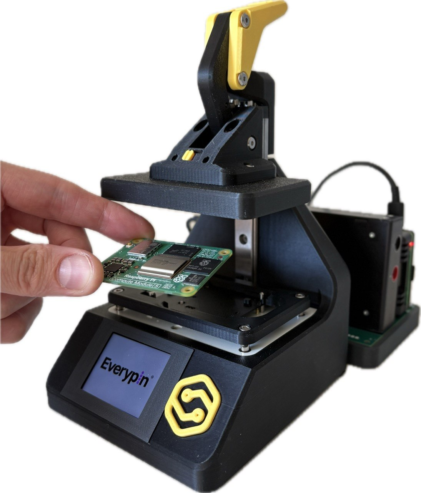
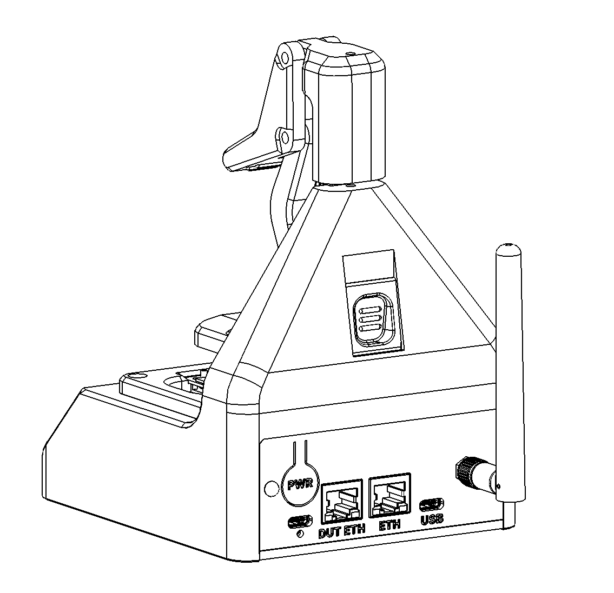

# CM5 Flash Jig

The CM5 Flash Jig is a production fixture for flashing Raspberry Pi Compute Module 5 modules through board test points. It is designed for teams that need to program multiple modules reliably without repeatedly using the 100-pin mezzanine connectors, carrier boards, or fragile manual cabling.

The jig combines mechanical alignment, pogo-pin contact, controlled power, USB boot handling, status indication, and automated flashing into one repeatable operator workflow.

{ width=400 }

## What It Is For

Use this jig when you need to:

- prepare CM5 eMMC modules in small-batch or production workflows;
- reduce manual handling and avoid repeated use of the Compute Module mezzanine connectors;
- make the flashing process repeatable for operators;
- catch basic electrical or boot issues before a module leaves the station;
- keep traceable records for each flashed module.

## Key Features

- Automated stand self-test before production starts.
- Image flashing to CM5 eMMC through Raspberry Pi USB boot mode.
- Power rail and total DUT current measurement during the cycle.
- Boot check after flashing.
- Built-in display for simple operator guidance.
- HardPy web interface for detailed progress, measurements, logs, and failure reasons.
- Local database and StandCloud report storage.

## System Overview

The complete stand is organized around a few functional blocks:

| Block | Role |
| --- | --- |
| Host controller | Raspberry Pi. Runs the stand self-test and the main HardPy cycle, including flashing, measurements, and boot checks. |
| Mechanical fixture with pogo pins | [Eloprint BAL jig](https://www.eloprint.com/#produkte). Positions the Compute Module, holds it in a repeatable operator-safe position, and contacts the required CM5 test points without using the mezzanine connectors. |
| Power and measurement subsystem | Supplies controlled power to the DUT and measures key electrical parameters during the cycle. |
| Operator interface | Shows simple production states on the built-in display and provides a detailed [HardPy](https://everypinio.github.io/hardpy/) web interface for live test information. |
| Reporting and data storage | Saves measured values, boot logs, and final results to the local database and [StandCloud](https://standcloud.io/). |

The built-in display is enough for routine production work: the operator can follow READY, FLASHING, PASS, and FAIL states directly on the jig. For detailed progress, measurements, logs, and failure reasons, the HardPy interface can be opened in a browser from any device on the same network as the host Raspberry Pi.

## Physical Specifications

| Parameter | Value |
| --- | --- |
| Overall dimensions | 140 x 115 x 180 mm |
| Mass | 520 g |


## How It Works

Before production starts, the stand runs a self-test to confirm that the host, fixture controls, measurement path, display, and required tools are ready. After the stand reaches READY, each DUT follows the main HardPy cycle:

1. The operator places a CM5 module into the jig.
2. Closing the lid aligns the module and brings the pogo pins into contact with the required test points.
3. The host Raspberry Pi holds `nRPIBOOT` low and powers the module.
4. The stand measures the module power rails and the total DUT current consumption.
5. `rpiboot` starts the Compute Module in USB mass-storage mode.
6. The host detects the DUT eMMC as a block device.
7. The selected image is written to the eMMC.
8. The fixture powers the module down, releases boot mode, and can perform a boot/status check.
9. The display and software report a final PASS or FAIL result.
10. All measured values, boot logs, and test results are saved into a report in the local database and [StandCloud](https://standcloud.io/).

## Operator Workflow

### Start the Stand

1. Open the jig lid and make sure that no Compute Module is installed.
2. Connect the USB-C 5 V / 3 A power supply to the USB-C power input on the rear panel.
3. Connect the power supply to mains power.
4. The stand starts automatically when power is connected. Do not press the power button during a normal start-up.
5. Wait while the host Raspberry Pi boots, HardPy starts, and the stand completes its automatic power-on self-test. Do not install a Compute Module during this phase.
6. Start production only when the display shows **READY**.

### Power Button

The power button is labeled **PWR** and is located on the rear panel above the USB-C power input:

- To shut down the stand normally, briefly press and release the power button. The display becomes completely dark after shutdown.
- If the stand is connected to power but the display is completely dark and shows no text, briefly press and release the button to start the stand.
- If the stand is unresponsive, press and hold the button to force it to power off. Use a forced power-off only when the stand has stopped responding, because it does not perform a normal software shutdown.

DUT power is controlled automatically by the test plan; the operator does not use this button to power the DUT.

{ width=600 }

### Display States

| Display | Meaning | Operator action |
| --- | --- | --- |
|  | A module is present or the lid is closed while the stand is preparing for work. | Open the lid and remove the module. Wait for the self-test to continue. This message is an instruction, not a test failure. |
|  | The stand passed its self-test and is waiting for a module. The live display adds a waiting timer. | Install one CM5 in the correct orientation using the mechanical guides, then close the lid fully. |
|  | Flashing and all required checks passed. | Open the lid and remove the module. The stand returns to **READY** for the next unit. |
|  | A required check failed. The live display adds **FAILED STEP** and the name of the first failed test case. | Follow the relevant FAIL procedure below before removing or retesting the module. |

During flashing and verification, the display shows terminal-style progress messages, including `FLASHING: writing image`. Do not open the lid or remove the module while these messages are active. Opening the lid during a running cycle stops the test.

### Normal Production Cycle

1. Wait for **READY**.
2. Place one Compute Module into the jig using the mechanical guides. The orientation is correct when the Raspberry Pi logo and the `Compute Module 5` marking are upright and readable from the operator's position.
3. Close the lid fully. The stand detects the module and starts the HardPy cycle automatically.
4. Wait while the stand powers, measures, flashes, and verifies the module.
5. Read the final **PASS** or **FAIL** result.
6. Open the lid and remove the module only after the test cycle has finished.
7. Wait for **READY** before installing the next unit.

### If the Power-On Self-Test Shows FAIL

A `FAIL` shown before the stand reaches **READY** is a stand self-test failure, not a failed DUT.

1. Do not install a Compute Module. Keep the jig empty and the lid open.
2. Record the complete text under **FAILED STEP** on the display.
3. Open the HardPy interface and record the failed self-test case number and name, together with the full error message. Power-on self-test cases are `1.1. Verify flash image`, `1.2. Verify host tools`, `2.1. Verify DUT is removed`, and `2.2. DUT power subsystem self-test`.
4. Check that the USB-C power cable is fully seated and that no module or foreign object is left in the jig.
5. Stop production on this stand and give the recorded case number, case name, and error message to the responsible technician. Do not continue to the main test plan until the self-test passes and **READY** is displayed.

### If the Main Test Plan Shows FAIL

1. Wait until the test cycle has finished and the display remains on **FAIL**. Do not open the lid while HardPy still reports that the cycle is running.
2. Read and record the complete **FAILED STEP** value. The leading value is the failed test case number; for example, `2.3. Flash image to DUT eMMC` means that case **2.3** failed.
3. Open the same case in HardPy and record its full error message and measurements. The short display message identifies the step; HardPy contains the diagnostic detail.
4. After the cycle has completed and DUT power has been switched off, open the lid and remove the module.
5. Mark the module as failed and route it according to the production failure process. Do not rerun it unless the responsible technician or production procedure permits a retest.

For routine work, the front-panel display provides the required operator guidance. The [HardPy](https://everypinio.github.io/hardpy/) interface is the source for detailed progress, measurements, logs, and failure reasons. From a laptop, tablet, or phone connected to the same local network, open `http://<stand-IP-address>:8000`, where `<stand-IP-address>` is the IP address of the stand's host Raspberry Pi.

## Network and Stand Configuration

### Connect the Stand to a Network

The stand supports two local-network connection methods:

- **Wired Ethernet:** connect the local-network cable to the rear-panel connector marked **ETH**. Do not use the **DUT ETH** connector for the stand's network connection.
- **Wi-Fi:** configure the host Raspberry Pi to connect to the required wireless network.

To configure Wi-Fi or other stand parameters, first connect the stand by wired Ethernet and open an SSH session:

```bash
ssh <username>@<stand-IP-address>
```

The SSH username and password are assigned individually to each stand. There is no shared default login. Obtain the credentials and IP address from the person responsible for the stand. After connecting, Wi-Fi can be configured using the standard Raspberry Pi OS network configuration tools.

After either Ethernet or Wi-Fi is configured, open the HardPy interface at:

```text
http://<stand-IP-address>:8000
```

### Configure StandCloud

1. Obtain the API key for this stand from [StandCloud](https://standcloud.io/) or from the StandCloud administrator.
2. Connect to the stand over SSH.
3. Open the `.env` file in the `cm5-flash-jig` installation directory. A typical path is `$HOME/cm5-flash-jig/.env`.
4. Set the following value:

   ```dotenv
   HARDPY_SC_API_KEY=<standcloud-api-key>
   ```

5. Save the file and restart the stand normally so the new setting is loaded.

The API key is a secret. Do not commit `.env`, copy the key into documentation, or share it between stands unless the StandCloud configuration explicitly requires this.

### Select the Image to Flash

The standard setup downloads a Raspberry Pi OS Lite 64-bit image to:

```text
$HOME/images/cm5-test.img.xz
```

A custom Raspberry Pi OS image can be copied to `$HOME/images/`. The flasher supports uncompressed `.img` files and images compressed as `.img.xz` or `.img.gz`.

Select the required image by setting its absolute path in `$HOME/cm5-flash-jig/.env`:

```dotenv
CM_FLASHER_IMAGE=/home/<username>/images/<image-file>.img.xz
```

Restart the stand normally after changing the image path. The next power-on self-test verifies that the selected file exists, is readable, has a supported extension, and can be decompressed by the installed tools.

## Compatibility

| Module | Status | Notes |
| --- | --- | --- |
| Raspberry Pi Compute Module 5 with eMMC | Supported target | The jig is designed around the CM5 test points used for power, USB boot, UART, and status signals. [Open the interactive CM5 test-point map](test-points/cm5/). |
| Raspberry Pi Compute Module 4 with eMMC | Not supported | The available CM4 test points do not expose the 5 V power, USB, UART, or boot signals required by the jig. Flashing CM4 through these test points is not supported. [Open the interactive CM4 test-point map](test-points/cm4/). |

## Safety Notes

- Make sure the CM5 is correctly aligned before closing the jig.
- Do not open the jig or remove the CM5 during flashing or testing. Wait until the display shows PASS or FAIL.
- Flashing erases the data already stored on the CM5 eMMC.
